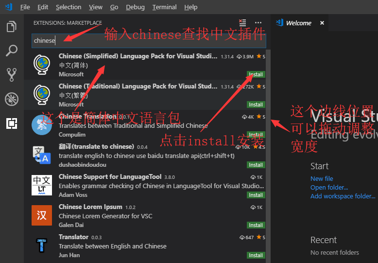

# vscode

- vscode知识点
- [返回文档目录](README.md)
- 基础部分
  - [vscode-安装](##vscode-install)
  - [vscode-基本配置](##vscode-config)
  - [vscode-一些快捷键](##vscode-shortcutkey)

## vscode-install

- vscode软件安装
- 点击[官方网站](https://code.visualstudio.com/)去下载  
    
    
    
    
    
    
    
    
    
    
    
- [返回目录](#vscode)

## vscode-config

- vscode基础配置  
    
    
    
    
    
    
    
    
    
    
    
    
    
- 配置代码  
  `{  
  "workbench.iconTheme": "vscode-great-icons",
  "css.fileExtensions": ["css"],
  "html.format.wrapLineLength": 400,
  "editor.detectIndentation": false,
  "editor.tabSize": 2,
  "prettier.printWidth": 400,
  "prettier.singleQuote": true,
  "prettier.disableLanguages": ["vue", "html"],
  "beautify.language": {
    "js": {
      "type": ["json"],
      "filename": [".jshintrc", ".jsbeautifyrc"]
    },
    "css": ["scss"],
    "html": ["htm", "html"]
  },
  "search.followSymlinks": false,
  "window.zoomLevel": 0
}`
- [返回目录](#vscode)
  
## vscode-shortcutkey

- 一些快捷键
- `alt+shift+f`格式化代码
- `ctrl+b`打开或者关闭侧边栏
- `ctrl+shift+k`删除行
- `ctrl+~`打开或者关闭终端
- `ctrl+p`切换标签
- `ctrl+/`注释或者取消注释
- `alt+b`在浏览器中打开（需要安装open in browser插件）
- `ctrl+k ctrl+o`打开文件夹
- `ctrl+s`保存文件
- `ctrl+c`复制
- `ctrl+v`粘贴
- `ctrl+x`剪切
- [返回目录](#vscode)